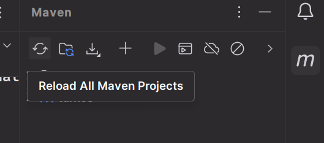
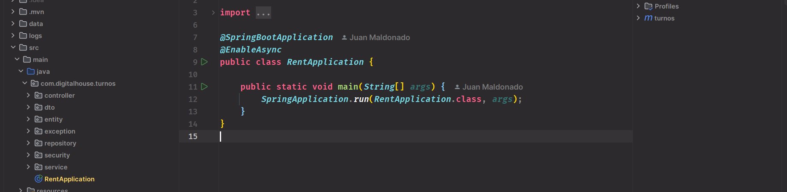
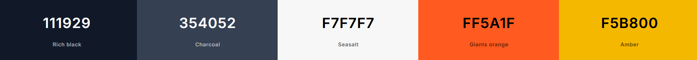

# 🚗Proyecto Integrador CTD:


**Definición del proyecto**: Aplicación web para la renta de vehículos desarrollada con Reactjs (frontend) y Java Spring Boot (backend).

## 📋 Características principales

- Autenticación de usuarios (login/registro)
- Sistema de reservas
- Sistema de reseñas
- Diseño responsivo
- Panel de administración (/administracion)
- Gestión de productos, categorías y usuarios

## 🛠️ Tecnologías utilizadas

**Frontend:**
- React
- React Router
- Context API
- Axios
- TailwindCSS

**Backend:**
- Java Spring Boot
- Maven
- JPA

**Testing:**
- Jest, Vitest, React Testing Library
- Mockito, JUnit

## 🚀 Guía de instalación
### Requisitos previos
Antes de comenzar, asegúrese de tener instalado:
- Node.js (versión 16.x o superior) [Descargar Node](https://nodejs.org/es/download)
- npm o yarn. (npm ya viene incluido en la instalación de Node)
- Java SDK 22.0.2 - Se puede instalar desde IntelliJ Idea o [Descargar SDK](https://www.oracle.com/java/technologies/javase/jdk22-archive-downloads.html)
- IntelliJ IDEA Community Edition (para backend) [Descargar IntelliJ](https://www.jetbrains.com/es-es/idea/download/?section=windows)
- Visual Studio Code (Opcional) [Descargar VSCode](https://code.visualstudio.com/download)
- Maven (Opcional) [Descargar Maven](https://maven.apache.org/download.cgi?.)

### Pasos de instalación

### 1. Clonar el repositorio
```sh
git clone https://github.com/JPMB91/desafio-profesional.git
cd desafio-profesional
```

### 2. Configuración e Inicialización del Backend
1. Navegue a la carpeta del backend:
   ```sh
   cd backend
   ```

2. Instale las dependencias:
   - **Opción A:** Si tiene Maven instalado:
     ```sh
     mvn clean install
     ```
   - **Opción B:** Si no tiene Maven:
     1. Abra la carpeta `/backend` con IntelliJ IDEA
     2. Haga clic en el botón de Maven y luego en "Reload All Maven Projects"
     
     

3. Inicie el servidor backend:
   - **Opción A:** Con Maven instalado:
     ```sh
     mvn spring-boot:run
     ```
   - **Opción B:** Desde IntelliJ IDEA:
     1. Localice el archivo `RentApplication.java` en `src/main/java/com/digitalhouse/turnos`
     2. Haga clic derecho y seleccione "Run RentApplication"
 
     

### 3. Configuración e Inicialización del Frontend
1. Navegue a la carpeta del frontend (desde la raíz del proyecto):
   ```sh
   cd frontend
   ```

2. Instale las dependencias:
   ```sh
   npm install
   ```

3. Inicie la aplicación frontend:
   ```sh
   npm run dev
   ```

Una vez que ambos servicios estén funcionando, acceda a la aplicación a través de su navegador en la dirección que muestra la terminal al iniciar el frontend: http://localhost:5173

> ⚠️ **NOTA:**  
> Este proyecto viene precargado con una cuenta con privilegios de administrador con el que se puede acceder a las rutas especiales.
>
> - **E-mail:** `admin@admin.com`  
> - **Contraseña:** `adminadmin`


> ⚠️ **NOTA:**  
> Para que reciba el correo electrónico luego de confimación de reserva, recuerde crear una cuenta de usuario desde la aplicación usando un correo electrónico al que tenga acceso.

## Paleta de colores



