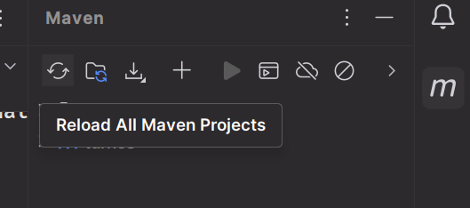
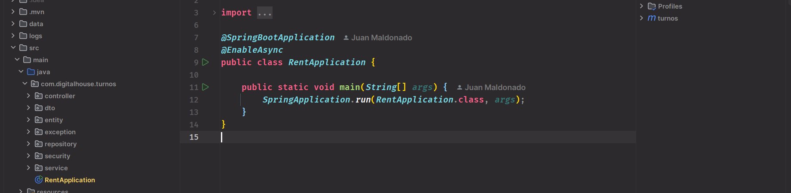

<!-- # 🚗Proyecto Integrador CTD:


Este proyecto se realizó utilizando Reactjs para su front-end y Java Springboot como API back-end.

Consiste en una aplicación de renta de vehículos que cuenta con las siguientes caracteriticas:

## 📌 Features

- Autenticación de usuarios (login/register)
- Sistema de reservas
- Sistema de reseñas
- Diseño responsivo
- Ruta exclusiva para administradores (/administracion)
- Listado, creación de nuevos productos
- Administración de categorias, usuarios y características del producto

## 🛠️ Tech Stack

- **Frontend**: React, React Router, Context API, Axios, TailwindCSS
- **Testing**: Jest, Vitest, React Testing Library, Mockito, Junit
- **Backend**: Java Spring Boot, Maven, JPA

## 🚀 Getting Started

### Prerequisitos

Asegurese de contar con los siguentes

- Node.js (>= 16.x)
- npm or yarn
- Java SDK 22.0.2
- Intellij Idea
- Visual Studio Code

### Instalación

1. Clone el repositorio:
    
    ```sh
    git clone https://github.com/JPMB91/desafio-profesional.git
    cd desafio-profesional
    ```
    
2. Instale dependencias 
  
  2.A: Backend
   ```sh
    cd backend
  ```

  En caso de tener instalado Maven puede a continuación usar el comando
   ```sh
    mvn clean install 
  ```
  
  De lo contrario, abre la carpeta /backend usando IntelliJ Idea y luego instale las dependecias haciendo click en botón de Maven y luego sobre "Reload All Maven Projects" .

  

  2.B: Frontend
  ```sh
  cd frontend
  npm install  
  ```

3. Lanzar la aplicacion

- Bakend
Si tiene instalado Maven en su equipo, dentro de la carpeta /backend ejecute el comando


 ```sh
 mvn spring-boot:run
  ```

De lo contrario, con el projecto abierto en IntelliJ Idea, ubique el archivo RentApplication.java en el directorio src/main/java/com/digitalhouse/turnos y ejecutelo 



Front End

dentro de la carpeta /frontend ejecute el comando

 ```sh
 npm run dev
  ``` -->

  # 🚗 Proyecto de Renta de Vehículos

Aplicación web para la renta de vehículos desarrollada con React (frontend) y Java Spring Boot (backend).

## 📋 Características principales

- Autenticación de usuarios (login/registro)
- Sistema de reservas
- Sistema de reseñas
- Diseño responsivo
- Panel de administración (/administracion)
- Gestión de productos, categorías y usuarios

## 🛠️ Tecnologías utilizadas

**Frontend:**
- React
- React Router
- Context API
- Axios
- TailwindCSS

**Backend:**
- Java Spring Boot
- Maven
- JPA

**Testing:**
- Jest, Vitest, React Testing Library
- Mockito, JUnit

## 🚀 Guía de instalación

### Requisitos previos

Antes de comenzar, asegúrese de tener instalado:

- Node.js (versión 16.x o superior)
- npm o yarn
- Java SDK 22.0.2
- IntelliJ IDEA (para backend)
- Visual Studio Code (recomendado para frontend)

### Pasos de instalación

#### 1. Clonar el repositorio

```sh
git clone https://github.com/JPMB91/desafio-profesional.git
cd desafio-profesional
```

#### 2. Configurar el Backend

1. Navegue a la carpeta del backend:
   ```sh
   cd backend
   ```

2. Instale las dependencias:
   - **Opción A:** Si tiene Maven instalado:
     ```sh
     mvn clean install
     ```
   - **Opción B:** Si no tiene Maven:
     1. Abra la carpeta `/backend` con IntelliJ IDEA
     2. Haga clic en el botón de Maven y luego en "Reload All Maven Projects"
     
     

#### 3. Configurar el Frontend

1. Navegue a la carpeta del frontend:
   ```sh
   cd frontend
   ```

2. Instale las dependencias:
   ```sh
   npm install
   ```

#### 4. Iniciar la aplicación

**Backend:**
- **Opción A:** Con Maven instalado:
  ```sh
  cd backend
  mvn spring-boot:run
  ```
- **Opción B:** Desde IntelliJ IDEA:
  1. Localice el archivo `RentApplication.java` en `src/main/java/com/digitalhouse/turnos`
  2. Haga clic derecho y seleccione "Run RentApplication"
  
  

**Frontend:**
```sh
cd frontend
npm run dev
```

Una vez que ambos servicios estén funcionando, acceda a la aplicación a través de su navegador en la dirección que muestra la terminal al iniciar el frontend: http://localhost:5173


[!NOTE]

Este proyecto viene precargado con una cuenta con privilegios de administrador con el que se puede acceder a las rutas especiales.

- E-mail: 

```
admin@admin.com
```
- Contraseña: 

```
adminadmin
```
